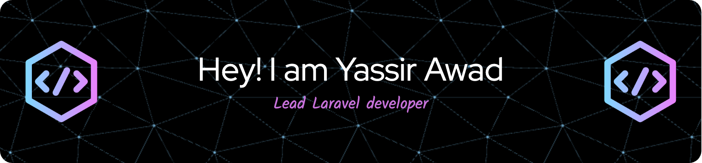

---

## About Me

**Lead Full-Stack Engineer** with over **9 years** of experience delivering **high-quality web applications**. I excel at:

- Architecting and building scalable solutions using **PHP**, **Laravel**, and **JavaScript**.
- Leading cross-functional teams and providing **technical leadership** in **Agile** environments.
- Working with a variety of **Cloud Services** (AWS, GCP) and modern DevOps practices (Docker, CI/CD).
- Ensuring **clean, test-driven code** and optimizing performance through best practices.

I’m passionate about creating impactful products, continuously improving processes, and fostering collaboration in tech teams.

---

## Contact Me

- **Email**: [com.eng.yassir@gmail.com](mailto:com.eng.yassir@gmail.com)
- **Twitter**: [@yassir3wad94](https://x.com/Yassir3wad94)
- **LinkedIn**: [linkedin.com/in/yassir3wad](https://www.linkedin.com/in/yassir3wad)
- **GitHub**: [github.com/yassir3wad](https://github.com/yassir3wad)

---

### Quick Facts
- **Location**: Cairo, Egypt
- **Languages**: English (Fluent), Arabic (Native)
- **Education**: Bachelor’s in Computer Engineering, IUG University (2012 - 2017)
---

## Tech Stack & Skills

### Backend

### Testing & Code Quality

### Frontend

### Cloud & DevOps

### Team & Project Management

[//]: # ([![Ashutosh's github activity graph]&#40;https://github-readme-activity-graph.vercel.app/graph?username=yassir3wad&#41;]&#40;https://github.com/ashutosh00710/github-readme-activity-graph&#41;)

---

## GitHub Stats

Thanks for stopping by! Let's build something great together.

